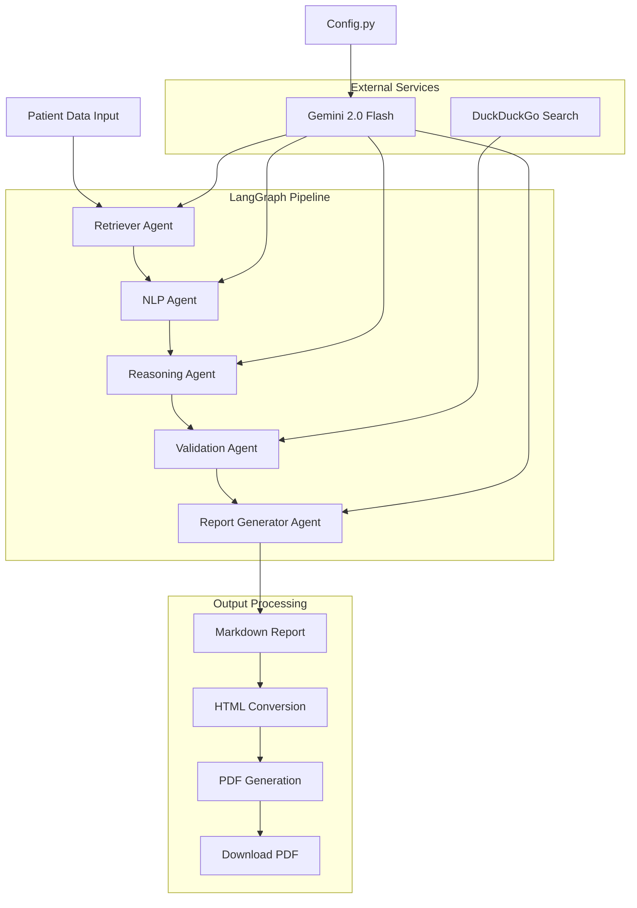

# Patient Lab & Genetic Report Generator

A POC application that automatically generates structured patient health reports from lab results, genetic data, and medical records using LangGraph agents and Gemini AI with online validation.

## Features

- **Multi-Agent Pipeline**: Retriever → NLP → Reasoning → Validation → Report Generator
- **Online Validation**: DuckDuckGo search integration for medical fact verification
- **Streamlit Interface**: User-friendly web interface
- **Professional PDF Generation**: Markdown to PDF conversion with WeasyPrint
- **Clinical Accuracy**: Medical context-aware analysis with validated information
- **Configurable Settings**: Centralized configuration for model parameters and API keys

## Architecture Flow



## Project Structure

```
health-report-generator/
├── app.py                      # Streamlit web interface
├── health_report_generator.py  # Core LangGraph pipeline
├── config.py                   # Configuration settings
├── requirements.txt            # Dependencies
├── .streamlit/
│   └── secrets.toml           # API keys configuration
└── README.md                  # This file
```

## Setup

1. **Install dependencies:**
```bash
pip install -r requirements.txt
```

2. **Configure API key:**
```bash
# create .streamlit/secrets.toml
[api_keys]
GEMINI_API_KEY = "your_gemini_api_key_here"
```

3. **Run the application:**
```bash
streamlit run app.py
```

## Usage

1. **Input Patient Data**: Enter lab results, genetic markers, and medical history
2. **Generate Report**: Click "Generate Report" for AI-powered analysis
3. **Download PDF**: Get professionally formatted PDF report
4. **Validation**: Reports include online-validated medical information

## Configuration

Modify `config.py` to customize:

- **Model**: Change Gemini model version
- **Temperature**: Adjust AI creativity/consistency
- **Search Limits**: Configure validation search parameters

```python
class Config:
    MODEL_NAME = "models/gemini-2.0-flash-exp"
    TEMPERATURE = 0.3
    MAX_SEARCH_RESULTS = 2
    MAX_SEARCH_TERMS = 2
```

## Agent Pipeline

### 1. Retriever Agent
- Organizes and structures patient data
- Prepares data for medical analysis

### 2. NLP Agent  
- Extracts critical medical findings
- Identifies lab anomalies and genetic markers
- Highlights key medical history points

### 3. Reasoning Agent
- Provides clinical interpretation
- Performs risk assessment
- Suggests potential diagnoses

### 4. Validation Agent
- Searches medical information online
- Validates findings against current medical knowledge
- Ensures report accuracy

### 5. Report Generator Agent
- Creates patient-friendly summaries
- Structures information clearly
- Generates markdown-formatted reports

## Output Features

- **Professional PDF**: Clean, medical-grade formatting
- **Validated Content**: Online fact-checking integration  
- **Specific Information**: Only includes sections with actual findings
- **No Generic Content**: Focuses on medical facts, not encouragement
- **Temporary Storage**: PDFs saved in system temp directory

## Dependencies

- `streamlit` - Web interface
- `langgraph` - Multi-agent workflow
- `langchain-google-genai` - Gemini AI integration
- `weasyprint` - PDF generation
- `markdown` - Content formatting
- `duckduckgo-search` - Online validation
- `python-dotenv` - Environment management

## Medical Disclaimer

This tool is for educational and demonstration purposes only. Always consult qualified healthcare professionals for medical advice and diagnosis.
